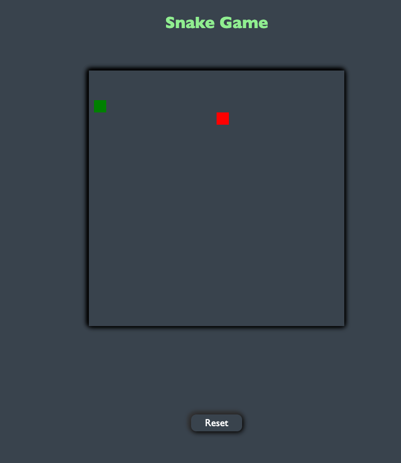
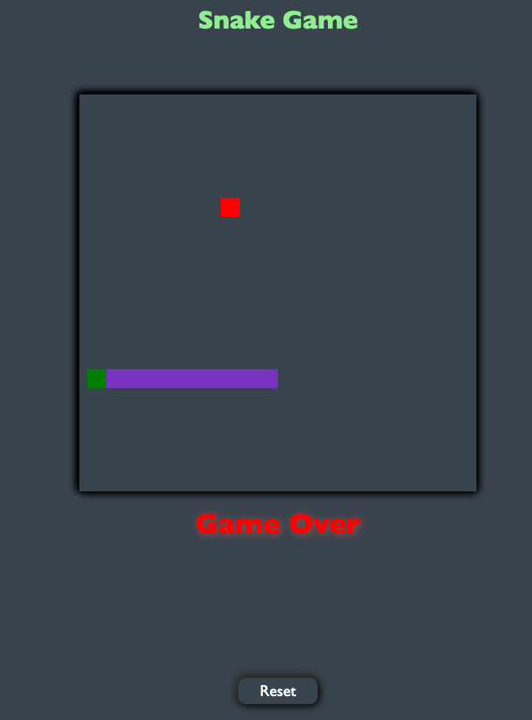
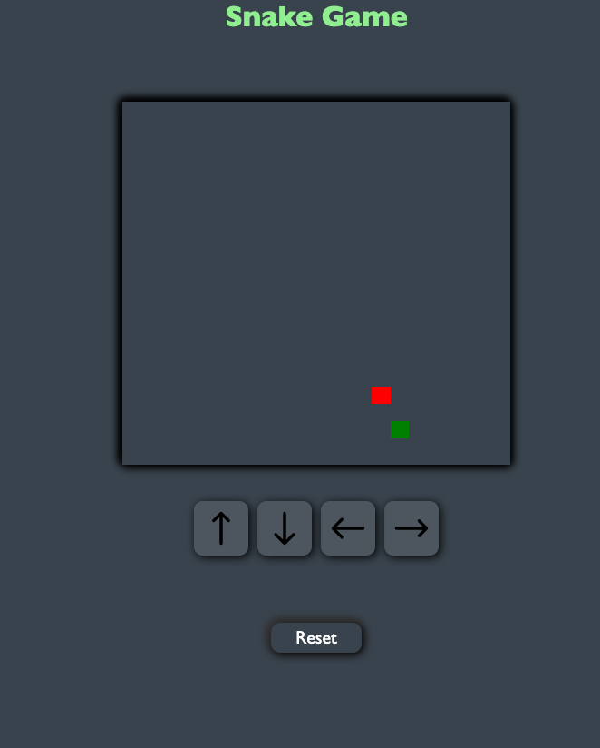
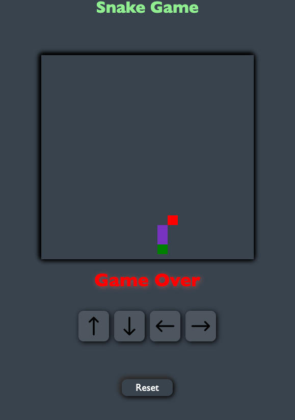

# Snake Game

A simple & basic Snake Game where user control a snake to eat food, grow longer and avoid crashing into wall as well as itself. user control the snake movement using arrow key on keyboard or on-screen controls. user try to eat more and more food to stay alive in game.

## Technologies Use To Build The Game

- HTML
- CSS
- JavaScript

### Image of game

#### Desktop version

#### Mobile Version

##

## Getting started

[click here]()

## Future Enhancement

- Add some more feature like total time user stay alive.
- Add score so user can see how many food they ate.
- Add some more CSS property to make game looks better and work properly in all of device.
